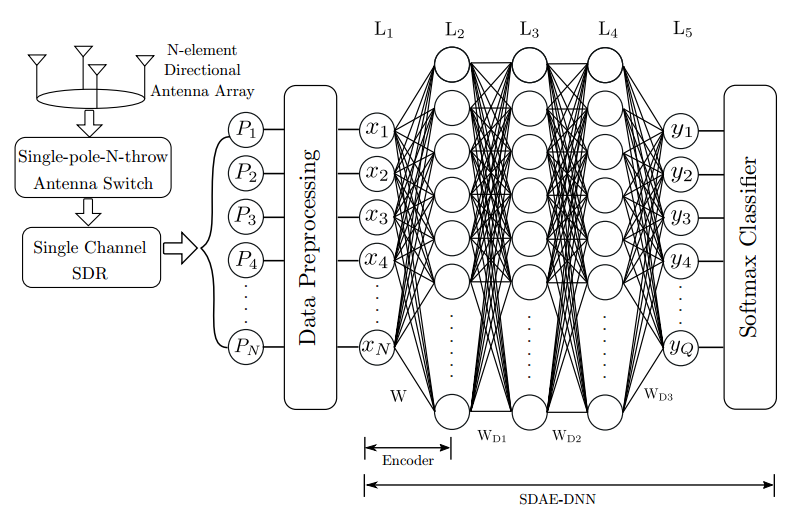
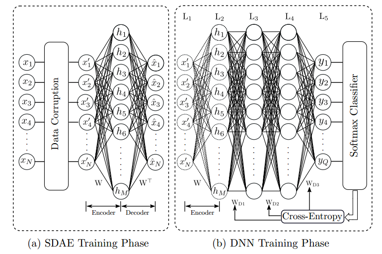

# DeepDOA
基于深度神经网络的稀疏降噪自编码器SDAE在小型无人机的测向实现。与子空间分解类算法ESPRIT和MUSIC算法进行比较。

由于相位同步机制、天线校准机制和天线辐射模式的分析模型都不是必要的，所以所提出的DF方案是实用且低复杂度的。此外，所提出的DF方法频偏分析方法可使用单通道射频接收机来实现。

For more details, please see our [Arxiv paper](https://arxiv.org/pdf/1712.01154.pdf).

### Whole Architecture:



### Architecture training phase:




### Dependencies

- Tensorflow (recommended below 1.5)
- Numpy 1.14.4

### Dataset

A partial dataset is provided to demonstrate our method
training data : Dround_Data_New/Normalized
testing data : Dround_Data_New/Normalized_test

data are categorized according to 45 degree sectors in training/testing data 
eg : 'deg_0_normalize.csv' data file represent the training data collected from the first sector and like wise there are 8 sectors considered for this study

For more details, please see our paper below.

### File description 

- DNN_Ground_data_8sectors.py : Implementation without SDAE
- DenoisingAE.py : Implementation of SDAE for training it separately to learn denoising features.
- get_csv_data.py : Data handler
- main.py : combining SDAE with a neural network to perform DOA estimations


### Citation

If this is useful for your work, please cite our [Arxiv paper](https://arxiv.org/pdf/1712.01154.pdf):

```bibtex
@article{abeywickrama2017rf,
  title={RF-Based Direction Finding of UAVs Using DNN},
  author={Abeywickrama, Samith and Jayasinghe, Lahiru and Fu, Hua and Yuen, Chau},
  journal={arXiv preprint arXiv:1712.01154},
  year={2017}
}
```
### License
This is released under the MIT license. For more details, please refer
[LICENSE](https://github.com/LahiruJayasinghe/DeepDOA/blob/master/LICENSE).

"Copyright (c) 2018 Lahiru Jayasinghe"
